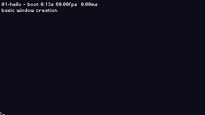
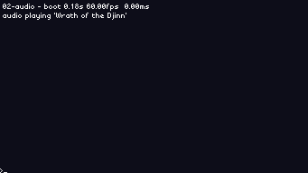
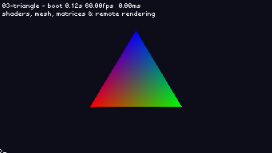
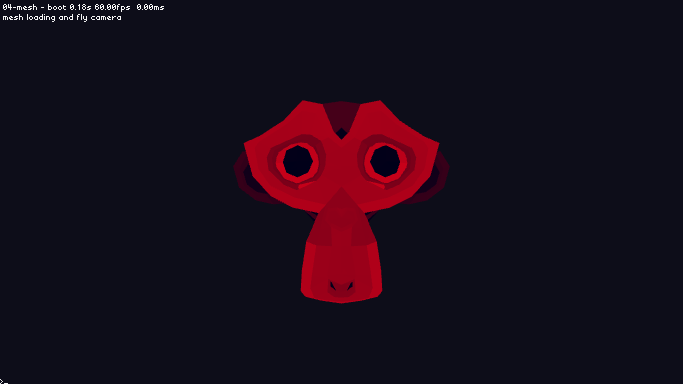
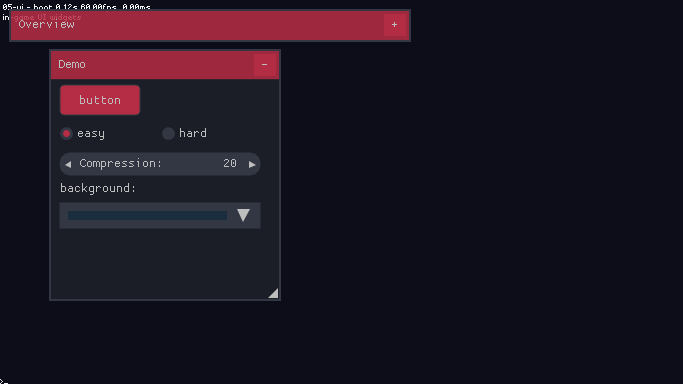
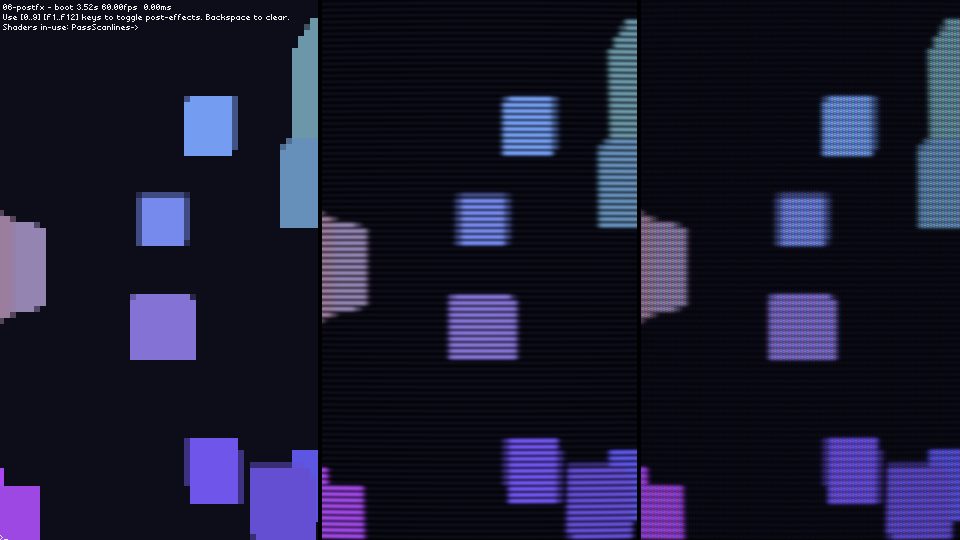
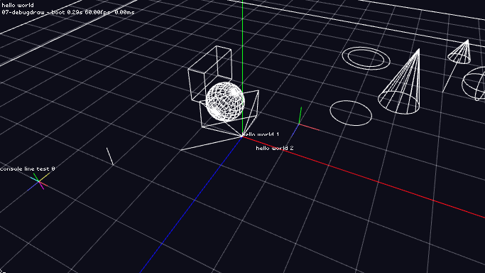
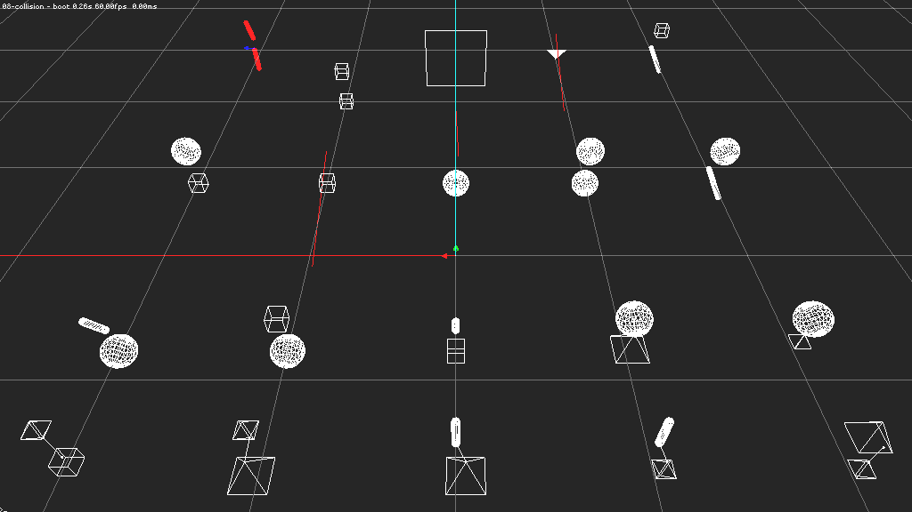

<p align="center">
<br/>
  <br/>
  ΛVΛ<br/>
  Small game engine.<br/>
  Written in 32 random ̷d̷a̷y̷s̷ m̷o̷n̷t̷h̷s̷ years.<br/>
<br/>|
  <a href="#features">Features</a> |
  <a href="#rationale">Rationale</a> |
  <a href="#getting-started">Getting started</a> |
<br/>|
  <a href="#licensing">Unlicense</a> |
  <a href="#documentation">Documentation</a> |
  <a href="#roadmap-ᕕᐛᕗ">Roadmap ᕕ(ᐛ)ᕗ</a> |
<br/>
<br/>
<br/>
<a href="https://discord.gg/vu6Vt9d"></a>
<a href="https://travis-ci.org/r-lyeh/AVA"></a>
<a href="https://github.com/r-lyeh/AVA/issues"></a>
<a href="http://unlicense.org/"></a>
<br/>
</p>

## Features

- [x] ~C++~. C.
- [x] ~Fast~. Simple.
- [x] ~Modern~. Readable.
- [x] ~Full featured~. Extendable.
- [x] ~Object-oriented~. Data-oriented.
- [x] ~Infinite documentation~. Browsable sources.
- [x] ~Hundred of file formats supported~. Unique binary format.
- [x] ~Royaltie fee~. Free and unlicensed.
- [x] ~Other buzzwords~. Small. Direct. Embeddable. Fun.

## Rationale

- Minimalistic coding style.
- Less is more, DOD, ECS, KISS.
- Heap allocations under control.
- No installation, no makefiles, fast compilation times.
- Generic 3D editor, that can be decoupled from the project.
- Generic asset pipeline, that can be decoupled from the project.
- JSON workflow: still human-readable, still mergeable.
- Inspiration from: ands, bitsquid, ccxvii, jo, krig, ocornut, procedural, rjm, rlk, sgorsten, stb, vurtun.

## Roadmap ᕕ(ᐛ)ᕗ

- [x] 00 Project structure, build system and makefiles.
- [x] 01 Window, rendering contexts and game loop.
- [ ] 02 File formats, hashing, encryption and compression.
- [x] 03 Timers, easings and interpolation.
- [ ] 04 Input bindings, digital+analog buttons, filters, gestures, chords and combos.
- [x] 05 Linear math, geometry, volumes and collisions.
- [ ] 06 Cameras and frustum culling.
- [ ] 07 Regions, triggers, trees and spatial partioning.
- [ ] 08 Data pipeline and asset journaling.
- [ ] 09 World streaming and level loading.
- [ ] 10 2D/2.5D/3D/VR renderer and post-effects.
- [x] 11 Fonts, atlases and text rendering.
- [ ] 12 Debug draw and debug UI.
- [ ] 13 Procedural content, brushes, voxels, noise and CSG.
- [ ] 14 Static meshes, decals, skyboxes and skydomes.
- [ ] 15 Sprites, sheets and spines.
- [ ] 16 Particles, billboards, emitters, trails and paths.
- [ ] 17 Skeletal animation, blending, blendspaces, IKs.
- [ ] 18 LODs, mesh instancing and scenegraphs.
- [ ] 19 Server/client architecture.
- [ ] 20 Message pipeline and serialization.
- [ ] 21 Digital signals, message buffering and event polling.
- [ ] 22 Entity/component/systems and world replication.
- [ ] 23 Scripting, bindings and game modules.
- [ ] 24 Navpoints, navmesh traversal and pathfinding.
- [ ] 25 AI, H/FSM, behavior trees and flocking.
- [ ] 26 Game flow and game UI.
- [ ] 27 Localization, subtitles and unicode.
- [ ] 28 2D/3D audio, HRTF, FFT, filtering and sound occlusion.
- [ ] 29 Dialogue, quests and inventory.
- [ ] 30 Full Motion Video and integrated cinematics.
- [ ] 31 Editor, gizmos, properties, timeline and data tracks.
- [ ] 32 Debugger, callstack, inspection, console, leaks, cvars and profiling.

## Screenshots

<p align="center">
<!--img src="games/demos/00-build.gif"  height="112px" title="Project structure and build system."-->








</p>

## Releases

2019.2 (Monkey3_Icarus), 2019.1 (YOB_Marrow)

## Getting started

Execute the `make.sh.bat` script file to build & run the editor.

Additionally:
- `make`                        (launch editor)
- `make game [platform]`        (launch game)
- `make make [game] [platform]` (make game.exe executable)
- `make cook [game] [platform]` (cook all raw game assets)
- `make pack [game] [platform]` (pack all cooked game assets into game.pak file)
- `make fuse [game] [platform]` (fuse game.pak and game.exe both together)

## Disk structure

- `editor/`, generic 3d editor and viewer.
- `engine/`, portable engine runtime.
- `games/`, games and demos.
- `tools/`, build tools & generic asset pipeline.

## Download

## Build

### AVA as engine:
- [x] Compile the amalgamated `engine.c` source file to get a functional game engine.
- [x] Compile your game as a dynamic library and place it near the `AVA` executable.
- [x] Tip: Rename both executable and dynamic library as desired. Ie, `game.exe` with `game.dll` will work.
- [x] Tip: Place an `.ico` icon close to the binary if you want to as well.
```lisp
cl      engine.c                && echo AVA as engine (Windows)
g++     engine.c                && echo AVA as engine (Linux)
clang++ engine.c                && echo AVA as engine (OSX)
```

### AVA as library:
- [x] Compile your game and link amalgamated `engine.c` source file with it.
```lisp
cl      game.c engine.c         && echo AVA as library (Windows)
g++     game.c engine.c         && echo AVA as library (Linux)
clang++ game.c engine.c         && echo AVA as library (OSX)
```

### Redistribution
```
- game.exe + .ico        (engine player)
- game.dll/.lua/.socket     (game logic) \
- game.rom/.pak        (ro data storage) | game :)
- game.ram/.sql        (rw data storage) /
```

## License
The project is released into the public domain (as per [this notice](LICENSE)). Any contribution to this repository is implicitly subjected to the same release conditions.

## Alternatives
[amulet](https://google.com/search?q=game+engine+amulet&type=),
[anvil](https://google.com/search?q=game+engine+anvil&type=),
[aroma](https://google.com/search?q=game+engine+aroma&type=),
[blendelf](https://google.com/search?q=game+engine+blendelf&type=),
[chickpea](https://google.com/search?q=game+engine+chickpea&type=),
[corange](https://google.com/search?q=game+engine+corange&type=),
[ejoy2d](https://google.com/search?q=game+engine+ejoy2d&type=),
[hate](https://google.com/search?q=game+engine+hate&type=),
[island](https://google.com/search?q=game+engine+island&type=),
[juno](https://google.com/search?q=game+engine+juno&type=),
[love](https://google.com/search?q=game+engine+love&type=),
[mini3d](https://google.com/search?q=game+engine+mini3d&type=),
[mio](https://google.com/search?q=game+engine+mio&type=),
[openframeworks](https://google.com/search?q=game+engine+openframeworks&type=),
[openkore](https://google.com/search?q=game+engine+openkore&type=),
[pez](https://google.com/search?q=game+engine+pez&type=),
[moon](https://google.com/search?q=game+engine+moon&type=),
[punity](https://google.com/search?q=game+engine+punity&type=),
[roam](https://google.com/search?q=game+engine+roam&type=),
[sushi](https://google.com/search?q=game+engine+sushi&type=),
[tigr](https://google.com/search?q=game+engine+tigr&type=),
